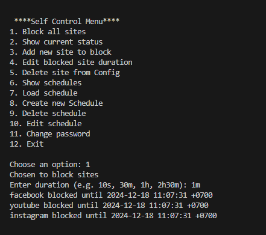
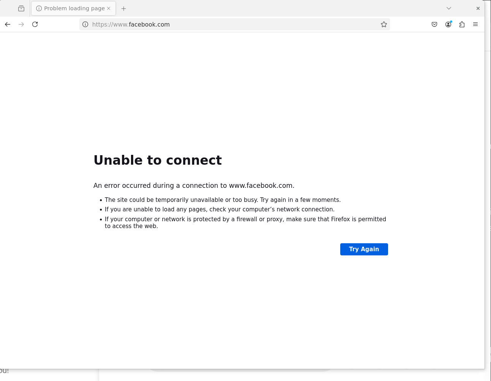
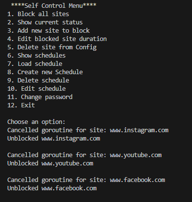

# 🌐 Website Blocker: Boost Your Productivity

Stay focused and eliminate distractions with this simple tool. Block websites that hinder your productivity and create a disciplined digital environment.

## ✨ Features

- 📅 Site Access Scheduling 
- 🔒 Encrypted Password Login 
- 🛑 Autonomous and Granular Site Blocking
- ♻️ Persistent Blocking Even After Restarts
- 🚀 Runs Seamlessly in the Background

## 🚨 Prerequisites

Before you begin:

- **Backup your `/etc/hosts` file** to avoid losing important configurations.

## 🛠️ How It Works

- Stores blocked sites and schedules in YAML files located in the `configs` folder.
- Modifies the `/etc/hosts file` to block specified websites based on the YAML configs.
- Redirects websites to `localhost`, preventing them from loading via the local DNS server.
- Background runtime writes to `nohup.out` for debugging.

## 📖 Instructions

### 1. Backup Your `/etc/hosts` File

Save a copy of the file to ensure you can revert changes if needed.

### 2. Initialise the Application

Execute the tool with administrative privileges to apply the website blocks.

```
go build -o selfcontrol
sudo ./selfcontrol
```

### 3. Rerun application after initialization

After application creates service file and updates the absolute path to executable, exit the application and run the following code to restart the application again.

```
go build -o selfcontrol
sudo ./selfcontrol
```

## ⚠️ Disclaimer

- Editing the `/etc/hosts` file requires **administrative privileges**.
- Do not tamper with yaml configs directly. Instead use the CLI menu to interact with configs
- Use this tool responsibly and proceed with caution.


## Service details
This is the code ran to create service file created by the application


- Create service file

```
sudo nano /etc/systemd/system/selfcontrol.service
```

- Add the following configurations to the file:

```
[Unit]
Description=Selfcontrol website blocker

[Service]
ExecStart=<path_to_selfcontrol_application>
Environment="SELFCONTROL_STARTUP=1"

[Install]
WantedBy=multi-user.target
```

- Reload systemd

```
sudo systemctl daemon-reload
```

- Enable the service

```
sudo systemctl enable selfcontrol.service
```

- Start the service

```
sudo systemctl start selfcontrol.service
```

**OR**

- Restart the service if already started

```
sudo systemctl restart selfcontrol.service
```

- Check the Service Status

```
sudo systemctl status selfcontrol.service
```

## If necessary, run the 4 lines of code below to remove completely remove service

```
sudo systemctl stop selfcontrol.service
```
```
sudo systemctl disable selfcontrol.service
```
```
sudo rm /etc/systemd/system/selfcontrol.service
```
```
sudo systemctl daemon-reload
```

## Results
- Currently working page


- Starting selfcontrol application and blocking sites  


- Sites are blocked and cannot be reached through browser


- Sites are unblocked at the end of the duration  

## 🚀 Let's Get Productive!

Take control of your time and focus!
